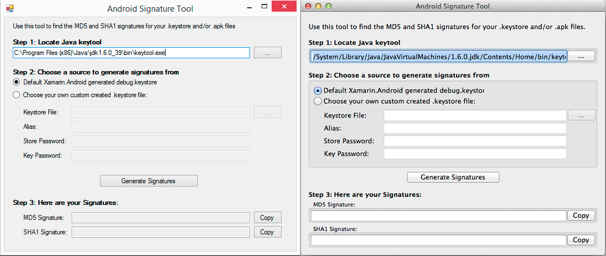

# Android Signature Tool

There are a number of services (Google Maps, Amazon to name a couple) which require that you get a MD5 or SHA1 hash/signature from the keystore file that's used to sign your app so that the service can generate a custom api key for you.

This is generally a pain, and finding these values is quite tedious.

This tool is meant to make it a bit quicker to find these values, especially if you are using Xamarin.Android.

### Default debug.keystore for Xamarin.Android
If you are using Xamarin.Android, by default your app is signed with a debug.keystore file (you probably didn't even know this, or need to, which is a good thing!).  This tool can track down that auto generated .keystore file (which is the same for all your apps, by the way) and grab the hash/signature for you by just clicking a single button.  This way, you don't need to know where keystore tool is, or where the debug.keystore was generated.

### Signed apps
If you are releasing to the Play Store, you've no doubt signed your app with your own .keystore file which you created.  You can still use this tool to find your hash/signature in that case, you just need to know where your .keystore file is located and what the alias/keypass/storepass are for the file.

